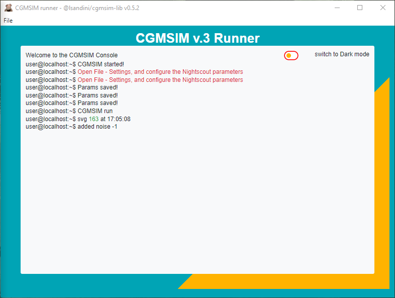
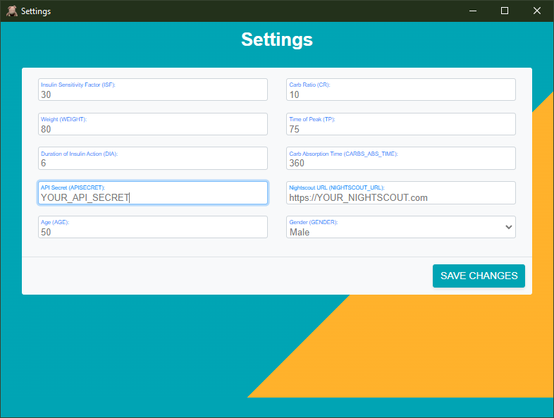
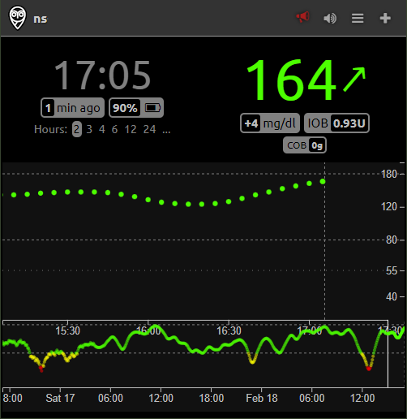

# cgmsim-runner-ui

This cross-platform application (built with [Electron](https://www.electronjs.org/)) allows you to use the public [cgmsim-lib](https://www.npmjs.com/package/@lsandini/cgmsim-lib) library in a local environment. The same library is used by the cloud-based [CGMSIM v.3](https://cgmsim.com) Type I diabetes simulator.

You will need to deploy an instance of [Nightscout](https://nightscout.github.io/) in order to visualize the CGM (continuous glucose monitoring) data graphically.

## Description

The library of functions [cgmsim-lib](https://www.npmjs.com/package/@lsandini/cgmsim-lib) performs computations for a defined virtual subject with Type I Diabetes. While initially designed for a cloud-based use, we designed a runner application with a user interface for local use. 

You will have to define physically your subject (Age, Gender, Height, Weight), and their physiological properties (Insulin Sensitivity Factor, Carbs-to-Insulin Ratio, etc). With all settings defined, the runner will start computing new CGM values every 5 minutes, displaying them in the main window, and uploading them to your Nightscout instance.

All treatment events (meals, insulin doses) must be declared in Nightscout's Careportal, as described in the [CGMSIM v.3 documentation](https://cgmsim.com/support/nightscout/meals.html).







## Features of the library🌟

- 📊 **CGM Data Generation:** Simulate realistic continuous glucose monitoring data over time.
- 💉 **Insulin (bolus/basal) Dosage Simulation:** Model insulin dosages and their effects on blood glucose levels.
- 🏃 **Physical Activity Simulation:** Introduce simulations of various physical activities and their impact on glucose levels.
- 🍺 **Alcohol Consumption Simulation:** Model the effects of alcohol consumption on blood glucose levels.
- 💊 **Corticosteroid Therapy Simulation:** Simulate the impact of cortisone therapy on glucose regulation.

## Installation

Before you begin, make sure you have Node.js and npm installed.

```bash
npm install
```

## Usage

### Development

Run the start script:

```bash
npm start
```

### Create distributable packages

Run the make script:

```bash
npm run make
```

_Please be aware that this package is not signed. In some cases, this may lead to antivirus software blocking the execution or causing errors within the program. If you encounter any issues, we recommend checking your antivirus settings and ensuring that our application is whitelisted._
